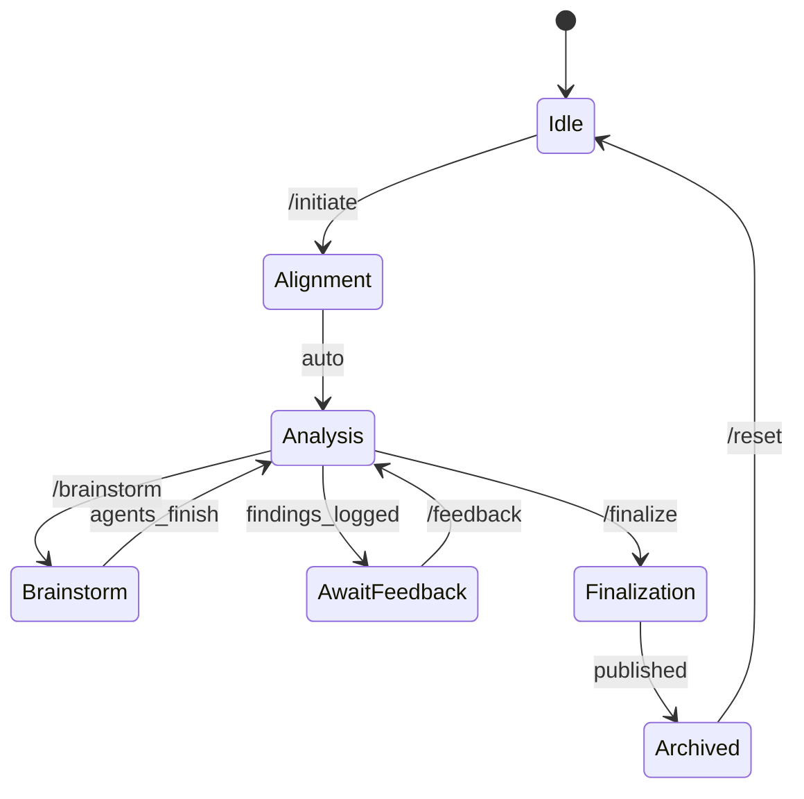

# Command Handling Specification – AI Overseer 🌐

_Last updated: {{DATE}}_

---

## Overview

This document defines how the Overseer orchestrator interprets and processes user-facing slash commands.

| Command | Purpose | Overseer Action | Log Impact | User Reply |
|---------|---------|-----------------|------------|------------|
| `/initiate` | Kick-off alignment & initial analysis phase. | • Confirm alignment  
• Enumerate next internal steps  
 | Create `Version X.Y – Alignment` section in `Overseer_Log.md`. | Explicit confirmation message only. No findings shared. |
| `/brainstorm` | Trigger agent brainstorming session. | • Run cross-domain idea generation  
• Validate proposals  
 | Append `Brainstorm Notes` subsection under current version. | Respond with generic acknowledgement (e.g., “Brainstorming in progress.”). No details leaked. |
| `/feedback <text>` | Accept user feedback / clarifications. | • Parse text payload  
• Update Assumptions & Open Questions  
• Potentially spawn / retire agents | Bump minor log version & append `Feedback Integration` section. | Acknowledge feedback processed. |
| `/finalize` | Request consolidated public report. | • Collate sanitized findings  
• Remove sensitive internal notes  
• Generate user-facing summary | Snapshot current log → `Overseer_Log_v<version>.md`  
Flag internal state as “Published”. | Provide detailed summary markdown to user. |
| `/reset` | Full reset of overseer state. | • Archive current session to `.overseer/archive/DATE/`  
• Clear in-memory structures  
• Re-initialize agents | Increment major log version.  
Create fresh `Version N.0 – Reset` header. | Confirm reset. |

---

## Versioning Rules

1. Semantic style **MAJOR.MINOR** where:  
   • MAJOR increments on `/reset` (global state wipe)  
   • MINOR increments on `/feedback` or large milestone (analysis, brainstorm cycles).
2. Each log snapshot must be committed to `.overseer/archive/` when finalized or reset.
3. Dates are recorded in ISO-8601.

---

## Internal State Machine

---

## Security & Privacy

- Under **no circumstance** are raw agent logs or sensitive code paths exposed unless sanitized via `/finalize`.
- All temporary working data resides in transient memory; only the markdown log is persisted.

---

## Implementation Notes

- Command detection is case-insensitive.
- Additional parameters after `/feedback` are treated as free-form markdown and inserted verbatim (after sanitization checks).
- Unrecognized commands elicit polite help text.