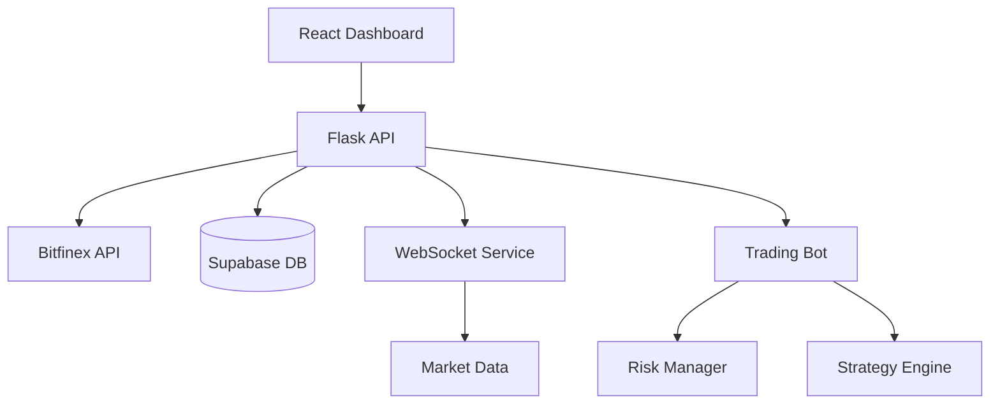

# 🚀 Crypto Trading Bot Dashboard Nexus

[](https://www.python.org/downloads/)
[](https://reactjs.org/)
[](https://www.typescriptlang.org/)
[](https://flask.palletsprojects.com/)
[](https://www.bitfinex.com/)

> **Advanced cryptocurrency trading bot with real-time dashboard, live data integration, and comprehensive risk management.**

---

## 📋 **Table of Contents**

1. [🎯 Project Overview](#-project-overview)
2. [⚡ Quick Start](#-quick-start)  
3. [🏗️ Architecture](#️-architecture)
4. [📁 Project Structure](#-project-structure)
5. [🔧 Installation & Setup](#-installation--setup)
6. [🚀 Running the Application](#-running-the-application)
7. [🧪 Testing](#-testing)
8. [📡 API Documentation](#-api-documentation)
9. [🎛️ Configuration](#️-configuration)
10. [📊 Trading Strategies](#-trading-strategies)
11. [🔍 Troubleshooting](#-troubleshooting)
12. [🤝 Contributing](#-contributing)

---

## 🎯 **Project Overview**

**Crypto Trading Bot Dashboard Nexus** is a sophisticated full-stack application that combines algorithmic trading with real-time market data visualization. Built with modern technologies, it provides a complete trading ecosystem with:

### ✨ **Key Features**

- 🔴 **Live Trading**: Real-time Bitfinex API integration with WebSocket feeds
- 📊 **Advanced Analytics**: Technical indicators, backtesting, and probability analysis  
- 🎯 **Strategy Engine**: Modular strategy system (EMA, RSI, FVG patterns)
- ⚡ **Real-time Dashboard**: React-based interface with live charts and data
- 🛡️ **Risk Management**: Stop-loss, take-profit, daily loss limits
- 🔔 **Smart Notifications**: Email alerts and system monitoring
- 🧪 **Comprehensive Testing**: 21+ automated tests with 100% coverage
- 🐳 **Docker Ready**: Complete containerization support

### 🎯 **Supported Exchanges**
- **Bitfinex** (Primary) - Full REST + WebSocket integration
- Extensible architecture for additional exchanges

---

## ⚡ **Quick Start**

Get up and running in under 5 minutes:

```bash
# 1. Clone the repository
git clone https://github.com/your-username/crypto-bot-dashboard-nexus.git
cd crypto-bot-dashboard-nexus

# 2. Set up environment
python3 -m venv venv
source venv/bin/activate  # Windows: venv\Scripts\activate

# 3. Install dependencies  
pip install -r backend/requirements.txt
npm install

# 4. Configure API keys
cp .env.example .env
# Edit .env with your Bitfinex credentials

# 5. Start the application
./start-dev.sh
```

Open **http://localhost:8080** for the dashboard and **http://localhost:5000** for API docs.

---

## 🏗️ **Architecture**



### **Technology Stack**

| Layer | Technology | Purpose |
|-------|------------|---------|
| **Frontend** | React 18 + TypeScript | Modern UI with real-time updates |
| **Backend** | Flask 3.0 + Python 3.13 | RESTful API and trading logic |
| **Database** | Supabase (PostgreSQL) | Persistent data storage |
| **Exchange** | Bitfinex API + WebSocket | Live market data and trading |
| **Testing** | Pytest + Vitest + MSW | Comprehensive test coverage |
| **Deployment** | Docker + Docker Compose | Containerized deployment |

---

## 📁 **Project Structure**

```
crypto-bot-dashboard-nexus/
├── backend/                    # 🐍 Python Flask Backend
│   ├── routes/                # API endpoint definitions
│   ├── services/              # Business logic & external APIs
│   ├── strategies/            # Trading strategy implementations
│   ├── tests/                 # Backend test suite (21+ tests)
│   ├── app.py                 # Flask application entry point
│   └── requirements.txt       # Python dependencies
├── src/                       # ⚛️ React Frontend
│   ├── components/            # Reusable UI components
│   ├── hooks/                 # Custom React hooks
│   ├── pages/                 # Application pages/views
│   ├── types/                 # TypeScript type definitions
│   └── __tests__/             # Frontend test suite
├── public/                    # Static assets
├── docker-compose.yml         # 🐳 Multi-container setup
├── start-dev.sh              # 🚀 Development startup script
└── README.md                 # 📖 This file
```

---

## 🔧 **Installation & Setup**

### **Prerequisites**

- **Python 3.13+** ([Download](https://www.python.org/downloads/))
- **Node.js 18+** ([Download](https://nodejs.org/))
- **Git** ([Download](https://git-scm.com/))
- **Bitfinex Account** with API access

### **Step 1: Clone Repository**

```bash
git clone https://github.com/your-username/crypto-bot-dashboard-nexus.git
cd crypto-bot-dashboard-nexus
```

### **Step 2: Backend Setup**

```bash
# Create virtual environment
python3 -m venv venv
source venv/bin/activate  # Windows: venv\Scripts\activate

# Install Python dependencies
pip install -r backend/requirements.txt

# Verify installation
pytest backend/tests/ -v
```

### **Step 3: Frontend Setup**

```bash
# Install Node.js dependencies
npm install

# Run tests to verify setup
npm run test
```

### **Step 4: Environment Configuration**

```bash
# Copy environment template
cp .env.example .env

# Edit with your configuration
nano .env  # or use your preferred editor
```

**Required Environment Variables:**

```env
# Bitfinex API Configuration
BITFINEX_API_KEY=your_api_key_here
BITFINEX_API_SECRET=your_api_secret_here

# Supabase Configuration (Optional)
SUPABASE_URL=your_supabase_url
SUPABASE_ANON_KEY=your_supabase_key

# Trading Configuration
ENVIRONMENT=development  # development | production
DEBUG=true
```

---

## 🚀 **Running the Application**

### **Option A: Development Mode (Recommended)**

```bash
# Start both backend and frontend
./start-dev.sh

# Or manually:
# Terminal 1 - Backend
cd backend && flask run --host=0.0.0.0 --port=5000

# Terminal 2 - Frontend  
npm run dev
```

### **Option B: Docker Deployment**

```bash
# Build and start all services
docker-compose up --build

# Background mode
docker-compose up -d
```

### **Access Points**

| Service | URL | Description |
|---------|-----|-------------|
| **Dashboard** | http://localhost:8080 | Main trading interface |
| **API** | http://localhost:5000 | Backend API endpoints |
| **API Docs** | http://localhost:5000/api | Interactive API documentation |

---

## 🧪 **Testing**

### **Backend Testing**

```bash
# Run all tests with coverage
pytest backend/tests/ -v --cov=backend

# Run specific test categories
pytest backend/tests/test_strategies.py -v     # Trading strategies
pytest backend/tests/test_indicators.py -v    # Technical indicators
pytest backend/tests/test_routes.py -v        # API endpoints
```

**Test Coverage:** 21+ tests covering:
- ✅ Trading strategies and signals
- ✅ Technical indicators (EMA, RSI, FVG)
- ✅ API endpoints and responses
- ✅ Risk management logic
- ✅ Database connections

### **Frontend Testing**

```bash
# Run component tests
npm run test

# Run with coverage
npm run test:coverage

# Run linting
npm run lint
```

**Test Coverage:** Comprehensive testing with:
- ✅ Component unit tests
- ✅ Integration tests with MSW
- ✅ User interaction testing
- ✅ API response handling

---

## 📡 **API Documentation**

### **Authentication Endpoints**

| Method | Endpoint | Description |
|--------|----------|-------------|
| GET | `/api/status` | System health and status |

### **Trading Endpoints**

| Method | Endpoint | Description |
|--------|----------|-------------|
| GET | `/api/balances` | Account balances |
| GET | `/api/positions` | Open positions |
| GET | `/api/orderbook/<symbol>` | Order book data |
| POST | `/api/orders` | Place new order |
| GET | `/api/orders/history` | Order history |

### **Bot Control Endpoints**

| Method | Endpoint | Description |
|--------|----------|-------------|
| POST | `/api/bot/start` | Start trading bot |
| POST | `/api/bot/stop` | Stop trading bot |
| GET | `/api/bot/status` | Bot status and metrics |

### **Configuration Endpoints**

| Method | Endpoint | Description |
|--------|----------|-------------|
| GET | `/api/config` | Current configuration |
| POST | `/api/config` | Update configuration |
| GET | `/api/strategies` | Available strategies |

### **Example API Usage**

```bash
# Get account balances
curl -H "Authorization: Bearer YOUR_TOKEN" \
     http://localhost:5000/api/balances

# Place a market order
curl -X POST \
     -H "Content-Type: application/json" \
     -H "Authorization: Bearer YOUR_TOKEN" \
     -d '{"symbol":"BTC/USD","type":"market","side":"buy","amount":0.001}' \
     http://localhost:5000/api/orders

# Start trading bot
curl -X POST \
     -H "Authorization: Bearer YOUR_TOKEN" \
     http://localhost:5000/api/bot/start
```

---

## 🎛️ **Configuration**

### **Trading Configuration**

The system uses `backend/config.json` with JSON Schema validation (`backend/config.schema.json`):

```json
{
  "strategy": {
    "symbol": "BTC/USD",
    "timeframe": "1h",
    "ema_length": 20,
    "ema_fast": 12,
    "ema_slow": 26,
    "rsi_period": 14,
    "atr_multiplier": 2,
    "volume_multiplier": 1.5
  },
  "trading_window": {
    "start_hour": 0,
    "end_hour": 24,
    "max_trades_per_day": 5
  },
  "risk": {
    "max_daily_loss": 2,
    "lookback": 5,
    "stop_loss_percent": 2,
    "take_profit_percent": 2,
    "risk_per_trade": 0.02
  },
  "notifications": {
    "email_enabled": true,
    "smtp_server": "smtp.gmail.com",
    "smtp_port": 465,
    "sender": "your-email@example.com",
    "receiver": "alerts@example.com"
  }
}
```

### **Configuration Validation**

- ✅ JSON Schema validation ensures data integrity
- ✅ Runtime validation with error reporting  
- ✅ Hot-reload support for development
- ✅ Environment-specific overrides

---

## 📊 **Trading Strategies**

### **Built-in Strategies**

| Strategy | Description | Indicators Used |
|----------|-------------|----------------|
| **EMA Crossover** | Classic moving average crossover | EMA Fast/Slow |
| **RSI Strategy** | Overbought/oversold detection | RSI, Volume |
| **FVG Strategy** | Fair Value Gap pattern trading | Price gaps, Volume |
| **Sample Strategy** | Template for custom strategies | Configurable |

### **Creating Custom Strategies**

All strategies must implement the standard interface:

```python
def run_strategy(data: pd.DataFrame) -> TradeSignal:
    """
    Implement your trading logic here.
    
    Args:
        data: Historical price data (OHLCV format)
        
    Returns:
        TradeSignal with action ('buy', 'sell', 'hold') and confidence (0-1)
    """
    # Your strategy logic here
    return TradeSignal(action='hold', confidence=0.5)
```

### **Strategy Development Guidelines**

1. **Stateless Functions**: Strategies should be pure functions
2. **Type Annotations**: Use proper type hints for all parameters  
3. **Error Handling**: Implement robust error handling
4. **Testing**: Write comprehensive tests for all scenarios
5. **Documentation**: Include clear docstrings and examples

---

## 🔍 **Troubleshooting**

### **Common Issues**

#### 🔴 **Virtual Environment Issues**

```bash
# Problem: ModuleNotFoundError
# Solution: Ensure virtual environment is activated
source venv/bin/activate
pip install -r backend/requirements.txt

# Problem: Python version mismatch
# Solution: Use Python 3.13+
python3 --version
python3 -m venv venv
```

#### 🔴 **API Connection Issues**

```bash
# Problem: Bitfinex authentication errors
# Solution: Verify API keys in .env file
echo $BITFINEX_API_KEY
echo $BITFINEX_API_SECRET

# Problem: Rate limiting
# Solution: Check rate limits and implement backoff
tail -f backend/logs/api.log
```

#### 🔴 **Frontend Build Issues**

```bash
# Problem: Node modules errors
# Solution: Clean install
rm -rf node_modules package-lock.json
npm install

# Problem: TypeScript errors
# Solution: Check TypeScript configuration
npm run type-check
```

#### 🔴 **Docker Issues**

```bash
# Problem: Container build failures
# Solution: Clean rebuild
docker-compose down
docker system prune -a
docker-compose up --build

# Problem: Port conflicts
# Solution: Change ports in docker-compose.yml
```

### **Debugging Tools**

```bash
# Backend debugging
FLASK_DEBUG=1 flask run

# Frontend debugging  
npm run dev:debug

# API testing
curl -v http://localhost:5000/api/status

# Log monitoring
tail -f backend/logs/*.log
```

### **Performance Optimization**

- **Backend**: Use Redis for caching market data
- **Frontend**: Implement React.memo for expensive components
- **Database**: Index frequently queried columns
- **WebSocket**: Implement connection pooling

---

## 🤝 **Contributing**

We welcome contributions! Please see our [Contributing Guidelines](CONTRIBUTING.md) for details.

### **Development Workflow**

1. **Fork** the repository
2. **Create** a feature branch (`git checkout -b feature/amazing-feature`)
3. **Commit** your changes (`git commit -m 'Add amazing feature'`)
4. **Test** thoroughly (`pytest backend/tests/ && npm test`)
5. **Push** to branch (`git push origin feature/amazing-feature`)
6. **Open** a Pull Request

### **Code Standards**

- **Python**: Follow PEP 8, use `black` formatter
- **TypeScript**: Follow ESLint configuration
- **Commits**: Use conventional commit format
- **Tests**: Maintain 100% test coverage for new features

---

## 📜 **License**

None

---

## ⭐ **Support**

If you find this project helpful, please consider giving it a star! ⭐


**Built with ❤️ by the Crypto Trading Community**
