# 🚀 Crypto Trading Bot Dashboard Nexus

[](https://www.python.org/downloads/)
[](https://reactjs.org/)
[](https://www.typescriptlang.org/)
[](https://flask.palletsprojects.com/)
[](https://www.bitfinex.com/)
[](https://github.com/your-username/crypto-bot-dashboard-nexus)

> **Advanced cryptocurrency trading bot with real-time dashboard, live data integration, and comprehensive risk management.**

## ⚠️ **Project Status: Under Active Development**

This project is currently **under active development** and may contain experimental features, breaking changes, and incomplete functionality. 

**⚠️ Important Notes:**
- This is **not production-ready** software
- API endpoints and features may change without notice
- Use at your own risk for trading activities
- Always test thoroughly in a safe environment before using with real funds

**🎯 Current Development Focus:**
- FastAPI migration from Flask
- Enhanced WebSocket integration
- Improved risk management features
- Frontend dashboard enhancements

---

## 📋 Table of Contents

1. [🎯 Project Overview](#project-overview)
2. [⚡ Quick Start](#quick-start)  
3. [🏗 Architecture](#architecture)
4. [📁 Project Structure](#project-structure)
5. [🔧 Installation & Setup](#installation--setup)
6. [🚀 Running the Application](#running-the-application)
7. [🧪 Testing](#testing)
8. [📡 API Documentation](#api-documentation)
9. [⚙️ Configuration](#configuration)
10. [📊 Trading Strategies](#trading-strategies)
11. [🔍 Troubleshooting](#troubleshooting)
12. [🤝 Contributing](#contributing)
13. [🚀 Testning & Optimering](#testning--optimering)

---

## 🎯 Project Overview

**Crypto Trading Bot Dashboard Nexus** is a sophisticated full-stack application that combines algorithmic trading with real-time market data visualization. Built with modern technologies, it provides a complete trading ecosystem with:

### ✨ Key Features

- 🔴 **Live Trading**: Real-time Bitfinex API integration with WebSocket feeds
- 📊 **Advanced Analytics**: Technical indicators, backtesting, and probability analysis  
- 🎯 **Strategy Engine**: Modular strategy system (EMA, RSI, FVG patterns)
- ⚡ **Real-time Dashboard**: React-based interface with live charts and data
- 🛡️ **Risk Management**: Stop-loss, take-profit, daily loss limits
- 🔔 **Smart Notifications**: Email alerts and system monitoring
- 🧪 **Comprehensive Testing**: 94+ automated tests with 99% coverage
- 🐳 **Docker Ready**: Complete containerization support

### 🎯 Supported Exchanges
- **Bitfinex** (Primary) - Full REST + WebSocket integration
- Extensible architecture for additional exchanges

---

## ⚡ Quick Start

Get up and running in under 5 minutes:

```bash
# 1. Clone the repository
git clone https://github.com/your-username/crypto-bot-dashboard-nexus.git
cd crypto-bot-dashboard-nexus

# 2. Set up environment
python3 -m venv venv
source venv/bin/activate  # Windows: venv\Scripts\activate

# 3. Install dependencies  
pip install -r backend/requirements.txt
npm install

# 4. Configure API keys
cp .env.example .env
# Edit .env with your Bitfinex credentials

# 5. Start the application
./scripts/deployment/start-dev.sh
```

Open **http://localhost:8080** for the dashboard and **http://localhost:5000** for API docs.

---

## 🏗 Architecture

```mermaid
graph TB
    %% Frontend
    subgraph "🎨 Frontend"
        UI["⚛️ React UI<br/>TypeScript + Tailwind"]
        WS["🔌 WebSocket Client"]
        API["🌐 API Client"]
    end

    %% API Layer
    subgraph "🚀 API Gateway"
        FastAPI["⚡ FastAPI<br/>Port 8001"]
        Flask["🐍 Flask<br/>Port 5000"]
        WS_API["📡 WebSocket API"]
    end

    %% Core Services
    subgraph "🧠 Core Services"
        BotManager["🤖 Bot Manager"]
        MainBot["🎯 Main Bot"]
        Config["⚙️ Config Service"]
    end

    %% Trading Services
    subgraph "📈 Trading Engine"
        LiveData["🔥 Live Data"]
        OrderService["📋 Order Service"]
        Positions["💼 Positions"]
        Portfolio["📊 Portfolio"]
        Risk["🛡️ Risk Manager"]
    end

    %% Exchange
    subgraph "🔗 Exchange Hub"
        BitfinexWrapper["🔄 Bitfinex Wrapper"]
        ExchangeAsync["⚡ Exchange Async"]
    end

    %% Strategies
    subgraph "🎯 Strategies"
        EMA["📈 EMA Strategy"]
        RSI["📊 RSI Strategy"]
        FVG["🎯 FVG Strategy"]
    end

    %% External
    subgraph "🌍 External"
        BitfinexAPI["🏦 Bitfinex API"]
        Supabase["🗄️ Supabase DB"]
    end

    %% Connections
    UI --> FastAPI
    UI --> Flask
    WS --> WS_API

    FastAPI --> BotManager
    FastAPI --> LiveData
    FastAPI --> OrderService
    FastAPI --> Positions
    FastAPI --> Portfolio
    FastAPI --> Risk

    Flask --> BotManager
    Flask --> LiveData
    Flask --> OrderService
    Flask --> Positions
    Flask --> Portfolio
    Flask --> Risk

    BotManager --> MainBot
    MainBot --> LiveData
    MainBot --> OrderService
    MainBot --> Positions
    MainBot --> Portfolio
    MainBot --> Risk
    MainBot --> Config

    LiveData --> ExchangeAsync
    OrderService --> ExchangeAsync
    Positions --> ExchangeAsync
    Portfolio --> ExchangeAsync

    ExchangeAsync --> BitfinexWrapper
    BitfinexWrapper --> BitfinexAPI

    MainBot --> EMA
    MainBot --> RSI
    MainBot --> FVG
```



### 🔄 Trading Flow

```mermaid
sequenceDiagram
    participant UI as "🎨 React UI"
    participant API as "🚀 FastAPI"
    participant Bot as "🤖 Bot Manager"
    participant Main as "🎯 Main Bot"
    participant Data as "🔥 Live Data"
    participant Exchange as "⚡ Exchange"
    participant Strategy as "🎯 Strategies"
    participant Risk as "🛡️ Risk Manager"
    participant Orders as "📋 Orders"
    participant Bitfinex as "🏦 Bitfinex"

    Note over UI,Bitfinex: 🚀 Trading Bot Startup
    UI->>API: 🚀 Start Bot Request
    API->>Bot: ⚡ start_bot()
    Bot->>Main: 🎯 main_async()
    
    Note over Main,Bitfinex: 📈 Trading Cycle Begins
    loop 🔄 Every 5 Minutes
        Main->>Data: 📊 Get Live Market Context
        Data->>Exchange: 🔥 Fetch OHLCV Data
        Exchange->>Bitfinex: 🌐 REST API Calls
        Bitfinex-->>Exchange: 📈 Real-time Market Data
        Exchange-->>Data: ⚡ Processed Data
        Data-->>Main: 🎯 Market Context Ready
        
        Note over Main,Strategy: 🧠 Strategy Analysis
        Main->>Strategy: 🎯 Run EMA, RSI, FVG
        Strategy-->>Main: 📊 Trading Signals Generated
        
        Note over Main,Risk: 🛡️ Risk Assessment
        Main->>Risk: 🛡️ Calculate Position Size
        Risk-->>Main: ✅ Position Size & Validation
        
        alt 🎯 Valid Trading Signal
            Note over Main,Orders: 📋 Order Execution
            Main->>Orders: 📋 Place Order
            Orders->>Exchange: ⚡ Submit Order
            Exchange->>Bitfinex: 🏦 Order API Call
            Bitfinex-->>Exchange: ✅ Order Confirmation
            Exchange-->>Orders: 📊 Order Result
            Orders-->>Main: 🎯 Order Status Update
        else ⚠️ Invalid Signal
            Main->>Main: ⏸️ Skip Trading Cycle
        end
        
        Main->>Bot: 📈 Increment Cycle Counter
    end
    
    Note over UI,Bitfinex: 🎉 Trading Cycle Complete
```



### Technology Stack

| Layer | Technology | Purpose |
|-------|------------|---------|
| **Frontend** | React 18 + TypeScript | Modern UI with real-time updates |
| **Backend** | Flask 3.0 + Python 3.11.9 | RESTful API and trading logic |
| **Database** | Supabase (PostgreSQL) | Persistent data storage |
| **Exchange** | Bitfinex API + WebSocket | Live market data and trading |
| **Testing** | Pytest + Vitest + MSW | Comprehensive test coverage |
| **Deployment** | Docker + Docker Compose | Containerized deployment |

---

## 📁 Project Structure

```
crypto-bot-dashboard-nexus/
├── backend/                    # 🐍 Python Flask Backend
│   ├── routes/                # API endpoint definitions
│   ├── services/              # Business logic & external APIs
│   ├── strategies/            # Trading strategy implementations
│   ├── tests/                 # Backend test suite (62+ tests)
│   │   └── integration/       # Real API integration tests (9 tests)
│   ├── app.py                 # Flask application entry point
│   └── requirements.txt       # Python dependencies
├── src/                       # ⚛️ React Frontend
│   ├── components/            # Reusable UI components
│   ├── hooks/                 # Custom React hooks
│   ├── pages/                 # Application pages/views
│   ├── types/                 # TypeScript type definitions
│   └── __tests__/             # Frontend test suite
├── docs/                      # 📚 Documentation
│   ├── development/           # Development guides and roadmaps
│   ├── guides/                # Implementation and usage guides
│   ├── reports/               # Analysis and status reports
│   └── solutions/             # Problem solutions and fixes
├── scripts/                   # 🛠 Development & Deployment Scripts
│   ├── deployment/            # Server startup scripts
│   ├── development/           # Code formatting and utilities
│   └── testing/               # Test automation tools
├── temp/                      # 🗂 Temporary files (Git ignored)
├── public/                    # Static assets
├── docker-compose.yml         # 🐳 Multi-container setup
└── README.md                  # 📖 This file
```

---

## 🔧 Installation & Setup

### Prerequisites

- **Python 3.11.9** ([Download](https://www.python.org/downloads/))
- **Node.js 18+** ([Download](https://nodejs.org/))
- **Git** ([Download](https://git-scm.com/))
- **Bitfinex Account** with API access

### Step 1: Clone Repository

```bash
git clone https://github.com/your-username/crypto-bot-dashboard-nexus.git
cd crypto-bot-dashboard-nexus
```

### Step 2: Backend Setup

```bash
# Create virtual environment
python3 -m venv venv
source venv/bin/activate  # Windows: venv\Scripts\activate

# Install Python dependencies
pip install -r backend/requirements.txt

# Verify installation
pytest backend/tests/ -v
```

### Step 3: Frontend Setup

```bash
# Install Node.js dependencies
npm install

# Run tests to verify setup
npm run test
```

### Step 4: Environment Configuration

```bash
# Copy environment template
cp .env.example .env

# Edit with your configuration
nano .env  # or use your preferred editor
```

**Required Environment Variables:**

```env
# Bitfinex API Configuration
BITFINEX_API_KEY=your_api_key_here
BITFINEX_API_SECRET=your_api_secret_here

# Supabase Configuration (Optional)
SUPABASE_URL=your_supabase_url
SUPABASE_ANON_KEY=your_supabase_key

# Trading Configuration
ENVIRONMENT=development  # development | production
DEBUG=true
```

---

## 🚀 Running the Application

### Option A: Quick Development Start (Recommended)

```bash
# ⚡ Fast start - runs from project root
./scripts/deployment/start-dev.sh
```

### Option B: Flexible Server Management

```bash
# Start both servers with health checks
./scripts/deployment/start-servers.sh

# Start only backend
./scripts/deployment/start-servers.sh backend

# Start only frontend
./scripts/deployment/start-servers.sh frontend
```

### Option C: Windows PowerShell

```powershell
# Windows users with PowerShell
.\scripts\deployment\start-servers.ps1

# With specific mode
.\scripts\deployment\start-servers.ps1 backend
```

### Option D: Manual Start (For Debugging)

```bash
# ⚠️ CRITICAL: Always run from project root!
cd crypto-bot-dashboard-nexus

# Terminal 1 - Backend
export FLASK_APP=backend/app.py
export FLASK_ENV=development
source venv/Scripts/activate  # Windows Git Bash
python -m flask run --host=0.0.0.0 --port=5000

# Terminal 2 - Frontend  
npm run dev
```

> **🚨 Important:** Flask must run from project root for SQLite database path resolution!

### Docker Deployment

```bash
# Build and start all services
docker-compose up --build

# Background mode
docker-compose up -d
```

### Access Points

| Service | URL | Description |
|---------|-----|-------------|
| **Dashboard** | http://localhost:8080 | Main trading interface |
| **API** | http://localhost:5000 | Backend API endpoints |
| **API Docs** | http://localhost:5000/api | Interactive API documentation |

---

## 🧪 Testing

### Backend Testing

```bash
# Run all tests with coverage
pytest backend/tests/ -v --cov=backend

# Run specific test categories
pytest backend/tests/test_strategies.py -v     # Trading strategies
pytest backend/tests/test_indicators.py -v    # Technical indicators
pytest backend/tests/test_routes.py -v        # API endpoints
```

**Test Coverage:** 62+ tests covering:
- ✅ Trading strategies and signals
- ✅ Technical indicators (EMA, RSI, FVG)
- ✅ API endpoints and responses
- ✅ Risk management logic
- ✅ Database connections
- ✅ WebSocket user data handlers
- ✅ Probability analysis systems
- ✅ Backtest engine and optimization

### Frontend Testing

```bash
# Run component tests
npm run test

# Run with coverage
npm run test:coverage

# Run linting
npm run lint
```

**Test Coverage:** Comprehensive testing with:
- ✅ Component unit tests
- ✅ Integration tests with MSW
- ✅ User interaction testing
- ✅ API response handling

> **Note:** Due to a limitation in FastAPI's dependency override system, some error-path tests for the positions API (e.g. simulating ExchangeError/Exception via query params) are currently skipped. See `backend/tests/test_fastapi_positions.py` and the FastAPI migration status documentation for details.

### Teststatus (2024-07-07)

- Unit-tester och mockade API-tester: 100% grönt
- API-tester (bot control): 2 fail (status: 'running' istället för 'stopped')
- WebSocket-tester: 11/14 gröna, 1 xfail (förväntat), 1 error (NameError), 1 fail (TypeError)
- Se [docs/guides/TESTING_OPTIMIZATION_GUIDE.md](docs/guides/TESTING_OPTIMIZATION_GUIDE.md) för detaljerad status, kända problem och åtgärdslista.

---

## 📡 API Documentation

### Authentication Endpoints

| Method | Endpoint | Description |
|--------|----------|-------------|
| GET | `/api/status` | System health and status |

### Trading Endpoints

| Method | Endpoint | Description |
|--------|----------|-------------|
| GET | `/api/balances` | Account balances |
| GET | `/api/positions` | Open positions |
| GET | `/api/orderbook/<symbol>` | Order book data |
| POST | `/api/orders` | Place new order |
| GET | `/api/orders/history` | Order history |

### Bot Control Endpoints

| Method | Endpoint | Description |
|--------|----------|-------------|
| POST | `/api/bot/start` | Start trading bot |
| POST | `/api/bot/stop` | Stop trading bot |
| GET | `/api/bot/status` | Bot status and metrics |

### Configuration Endpoints

| Method | Endpoint | Description |
|--------|----------|-------------|
| GET | `/api/config` | Current configuration |
| POST | `/api/config` | Update configuration |
| GET | `/api/strategies` | Available strategies |

### Example API Usage

```bash
# Get account balances
curl -H "Authorization: Bearer YOUR_TOKEN" \
     http://localhost:5000/api/balances

# Place a market order
curl -X POST \
     -H "Content-Type: application/json" \
     -H "Authorization: Bearer YOUR_TOKEN" \
     -d '{"symbol":"BTC/USD","type":"market","side":"buy","amount":0.001}' \
     http://localhost:5000/api/orders

# Start trading bot
curl -X POST \
     -H "Authorization: Bearer YOUR_TOKEN" \
     http://localhost:5000/api/bot/start
```

---

## ⚙️ Configuration

### Trading Configuration

The system uses `backend/config.json` with JSON Schema validation (`backend/config.schema.json`):

```json
{
  "strategy": {
    "symbol": "BTC/USD",
    "timeframe": "1h",
    "ema_length": 20,
    "ema_fast": 12,
    "ema_slow": 26,
    "rsi_period": 14,
    "atr_multiplier": 2,
    "volume_multiplier": 1.5
  },
  "trading_window": {
    "start_hour": 0,
    "end_hour": 23
  },
  "risk_management": {
    "max_position_size": 0.1,
    "stop_loss_percentage": 0.02,
    "take_profit_percentage": 0.04,
    "daily_loss_limit": 0.05
  }
}
```

### Environment Variables

Create `.env` file from `.env.example`:

```env
# Required - Bitfinex API
BITFINEX_API_KEY=your_api_key
BITFINEX_API_SECRET=your_api_secret

# Optional - Database
DATABASE_URL=sqlite:///./local.db

# Optional - Supabase
SUPABASE_URL=your_url
SUPABASE_ANON_KEY=your_key

# Application
ENVIRONMENT=development
DEBUG=true
FLASK_ENV=development
```

---

## 📊 Trading Strategies

### Available Strategies

| Strategy | Description | Parameters |
|----------|-------------|------------|
| **EMA Crossover** | Uses fast/slow EMA crossovers | `ema_fast`, `ema_slow` |
| **RSI Strategy** | Overbought/oversold RSI signals | `rsi_period`, `rsi_overbought`, `rsi_oversold` |
| **FVG Strategy** | Fair Value Gap pattern detection | `atr_multiplier`, `volume_multiplier` |
| **Sample Strategy** | Template for custom strategies | Configurable parameters |

### Strategy Implementation

Each strategy must implement the interface:

```python
def run_strategy(data: pd.DataFrame) -> TradeSignal:
    """
    Execute trading strategy logic.
    
    Args:
        data: OHLCV price data with indicators
        
    Returns:
        TradeSignal: BUY, SELL, or HOLD
    """
    # Strategy implementation
    pass
```

### Backtesting

```bash
# Run strategy backtest
curl -X POST \
     -H "Content-Type: application/json" \
     -d '{"strategy":"ema_crossover","symbol":"BTC/USD","timeframe":"1h"}' \
     http://localhost:5000/api/backtest
```

---

## 🔍 Troubleshooting

### Common Issues

#### Backend Won't Start
```bash
# Check if running from project root
pwd  # Should show crypto-bot-dashboard-nexus

# Activate virtual environment
source venv/bin/activate  # Linux/Mac
venv\Scripts\activate     # Windows

# Check Flask app path
export FLASK_APP=backend/app.py
```

#### Frontend Proxy Errors
```bash
# Ensure backend is running on port 5000
curl http://localhost:5000/api/status

# Check Vite proxy configuration in vite.config.ts
```

#### Database Issues
```bash
# Reset SQLite database
rm local.db
python -c "from backend.app import create_app; create_app()"
```

#### Virtual Environment Issues
```bash
# Recreate virtual environment
rm -rf venv
python3 -m venv venv
source venv/bin/activate
pip install -r backend/requirements.txt
```

### Debug Mode

Enable debug logging:

```env
# In .env file
DEBUG=true
FLASK_DEBUG=true
```

### Health Checks

```bash
# Backend health
curl http://localhost:5000/api/status

# Frontend health
curl http://localhost:8080

# WebSocket connectivity
# Check browser console for WebSocket errors
```

---

## 🤝 Contributing

### Development Workflow

1. **Fork** the repository
2. **Create** feature branch: `git checkout -b feature/amazing-feature`
3. **Follow** coding standards (see `.cursor/rules/`)
4. **Write** tests for new functionality
5. **Run** full test suite: `pytest backend/tests/ && npm test`
6. **Commit** with conventional format: `feat: add amazing feature`
7. **Push** to branch: `git push origin feature/amazing-feature`
8. **Create** Pull Request

### Code Standards

- **Python**: PEP 8, Black formatting, type hints
- **TypeScript**: Strict mode, ESLint, Prettier
- **Tests**: 80%+ coverage requirement
- **Documentation**: JSDoc for functions, docstrings for Python

### Testing Requirements

```bash
# Backend tests must pass
pytest backend/tests/ -v --cov=backend --cov-report=term-missing

# Frontend tests must pass
npm run test

# Linting must pass
npm run lint
flake8 backend/
```

### Project Structure Guidelines

- **Routes**: RESTful API design only
- **Services**: Business logic separation
- **Components**: Reusable React components
- **Types**: Comprehensive TypeScript definitions

---

## 📄 License

This project is licensed under the MIT License - see the [LICENSE](LICENSE) file for details.

---

## 🙏 Acknowledgments

- **Bitfinex** for comprehensive API and WebSocket support
- **React + TypeScript** community for excellent tooling
- **Flask** ecosystem for robust backend framework
- **ccxt** library for exchange integration

---

## 📞 Support

- **Documentation**: [docs/](docs/)
- **Issues**: [GitHub Issues](https://github.com/your-username/crypto-bot-dashboard-nexus/issues)
- **Wiki**: [Project Wiki](https://github.com/your-username/crypto-bot-dashboard-nexus/wiki)

---

**🚀 Happy Trading!** Built with ❤️ for the crypto community.

## 🚀 Testning & Optimering

Projektet har nu en optimerad teststruktur med:
- Snabba unit- och mock-tester
- Markerade testkategorier (unit, mock, api, integration, e2e, fast, slow)
- Nya test-runner-skript för snabb och CI-optimerad körning

### Exempel på testkommandon

```bash
python scripts/testing/run_tests_fast.py --fast-only      # Endast snabba tester
python scripts/testing/run_tests_fast.py --mock-only      # Endast mock-tester
python scripts/testing/run_tests_fast.py --api-only       # Endast API-tester
python scripts/testing/run_tests_fast.py --slow-only      # Endast långsamma tester
python scripts/testing/run_tests_ci.py --all              # Kör alla tester i optimal ordning
```

Se [docs/guides/TESTING_OPTIMIZATION_GUIDE.md](docs/guides/TESTING_OPTIMIZATION_GUIDE.md) för fullständig dokumentation och rekommenderad arbetsordning.