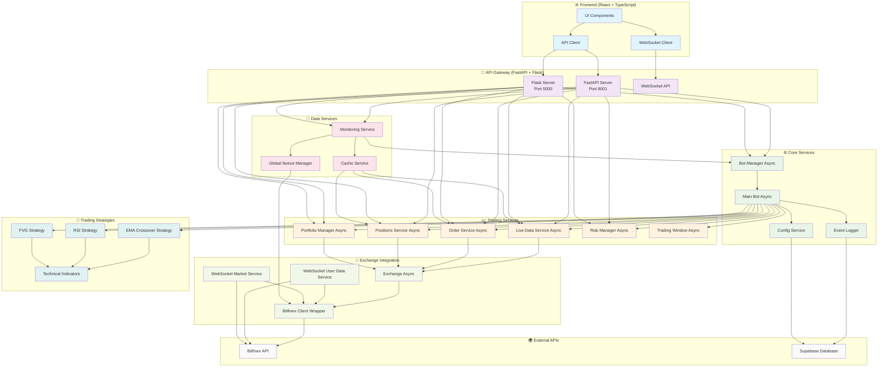
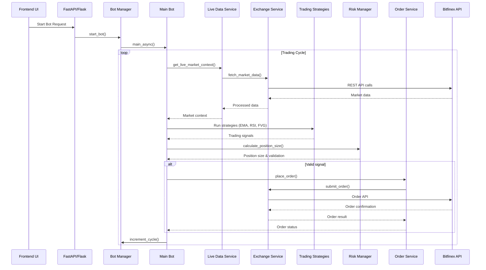
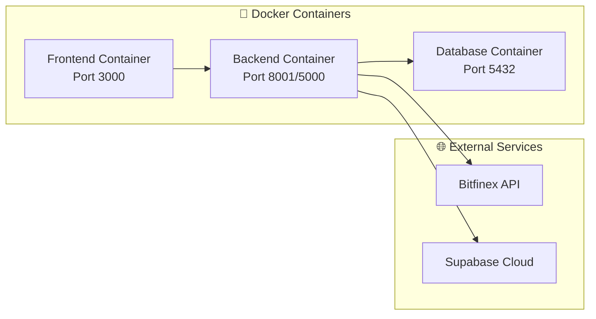

# 🏗️ Crypto Trading Bot - Arkitekturdiagram

## 📊 Systemöversikt

## 🔄 Dataflöde

## 🏛️ Komponentarkitektur

### **Frontend Layer**
- **React + TypeScript**: Modern UI med komponenter
- **WebSocket Client**: Realtidsdata för marknadsuppdateringar
- **API Client**: REST API-anrop till backend

### **API Gateway Layer**
- **FastAPI Server** (Port 8001): Modern asynkron API
- **Flask Server** (Port 5000): Legacy API (under migration)
- **WebSocket API**: Realtidskommunikation

### **Core Services Layer**
- **Bot Manager Async**: Central bot-kontroll och tillståndshantering
- **Main Bot Async**: Huvudlogik för trading-cykler
- **Config Service**: Konfigurationshantering
- **Event Logger**: Loggning och övervakning

### **Trading Services Layer**
- **Live Data Service Async**: Realtidsmarknadsdata
- **Order Service Async**: Orderhantering
- **Positions Service Async**: Positioner och P&L
- **Portfolio Manager Async**: Portföljhantering
- **Risk Manager Async**: Riskhantering och position sizing
- **Trading Window Async**: Trading-tidsfönster

### **Data Services Layer**
- **Cache Service**: Aggressiv caching för prestanda
- **Global Nonce Manager**: Nonce-hantering för API-anrop
- **Monitoring Service**: Systemövervakning

### **Exchange Integration Layer**
- **Bitfinex Client Wrapper**: Wrapper för Bitfinex API
- **Exchange Async**: Asynkron exchange-integration
- **WebSocket Services**: Realtidsdata via WebSocket

### **Strategy Layer**
- **EMA Crossover Strategy**: Moving average-strategi
- **RSI Strategy**: Relative Strength Index-strategi
- **FVG Strategy**: Fair Value Gap-strategi
- **Technical Indicators**: Tekniska indikatorer

## 🔧 Teknisk Stack

| Layer | Technology | Purpose |
|-------|------------|---------|
| Frontend | React + TypeScript + Tailwind | Modern UI |
| API Gateway | FastAPI + Flask | REST API |
| Core Logic | Python 3.11 + asyncio | Trading logic |
| Database | Supabase (PostgreSQL) | Persistence |
| Exchange | Bitfinex API | Market data & trading |
| Caching | In-memory + Redis | Performance |
| Monitoring | Custom logging | System health |

## 🚀 Deployment

## 📈 Prestanda & Skalbarhet

- **Asynkron arkitektur**: Högt genomflöde med asyncio
- **Aggressiv caching**: Minska API-anrop till Bitfinex
- **Nonce-hantering**: Undvik rate limiting
- **Event-driven logging**: Effektiv loggning
- **Modulär design**: Enkel att skala och underhålla

## 🔒 Säkerhet

- **API Key Management**: Säker hantering av Bitfinex-nycklar
- **Nonce Validation**: Förhindra replay-attacker
- **Input Validation**: Pydantic-modeller för validering
- **Error Handling**: Robust felhantering
- **Logging**: Säker loggning utan känslig data 