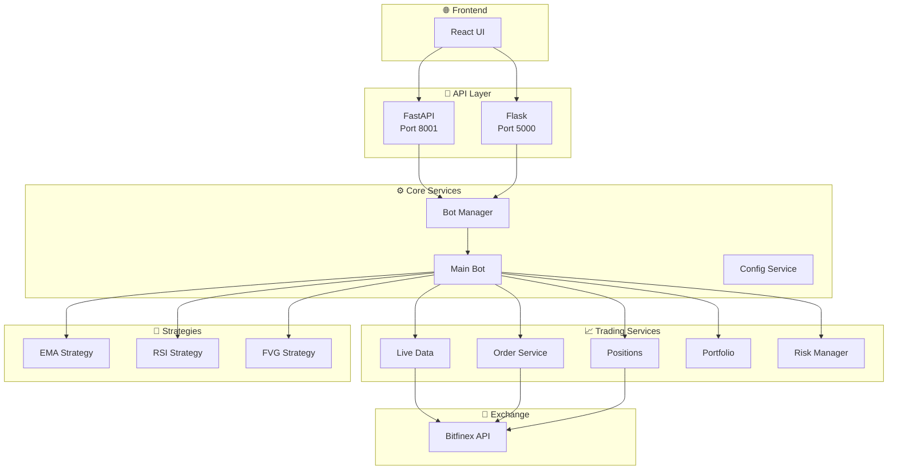
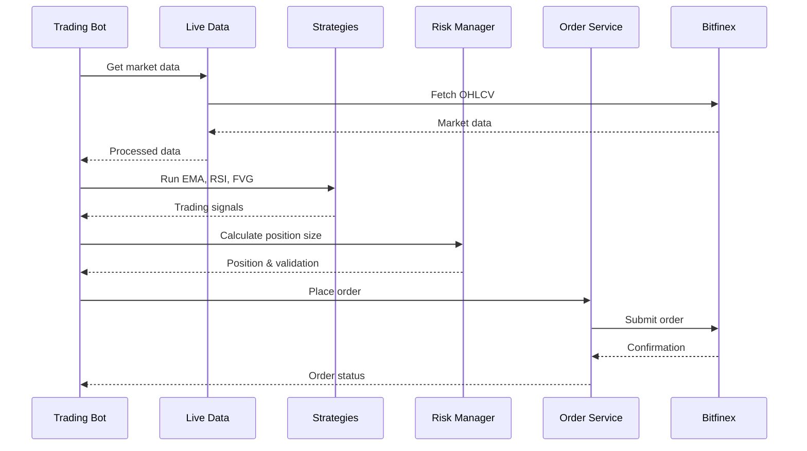

# 🏗️ Crypto Trading Bot - Enkel Arkitektur

## 📊 Systemöversikt

## 🔄 Trading Flow

## 🏛️ Komponenter

| Komponent | Syfte | Status |
|-----------|-------|--------|
| **Frontend** | React UI för kontroll | ✅ Aktiv |
| **FastAPI** | Modern API (Port 8001) | 🔄 Migration |
| **Flask** | Legacy API (Port 5000) | ✅ Aktiv |
| **Bot Manager** | Bot-kontroll | ✅ Aktiv |
| **Main Bot** | Trading-logik | ✅ Aktiv |
| **Live Data** | Realtidsdata | ✅ Aktiv |
| **Order Service** | Orderhantering | ✅ Aktiv |
| **Risk Manager** | Riskhantering | ✅ Aktiv |
| **Strategies** | EMA, RSI, FVG | ✅ Aktiva |
| **Bitfinex API** | Exchange-integration | ✅ Aktiv |

## 🔧 Teknisk Stack

- **Frontend**: React + TypeScript + Tailwind CSS
- **Backend**: Python 3.11 + FastAPI + Flask
- **Database**: Supabase (PostgreSQL)
- **Exchange**: Bitfinex API
- **Deployment**: Docker + Docker Compose

## 📈 Funktioner

- ✅ **Realtidsdata** från Bitfinex
- ✅ **Multi-strategy** trading (EMA, RSI, FVG)
- ✅ **Risk management** med position sizing
- ✅ **Portfolio tracking** och P&L
- ✅ **WebSocket** för realtidsuppdateringar
- ✅ **Event logging** och övervakning
- ✅ **Paper trading** för testning
- 🔄 **FastAPI migration** pågår 